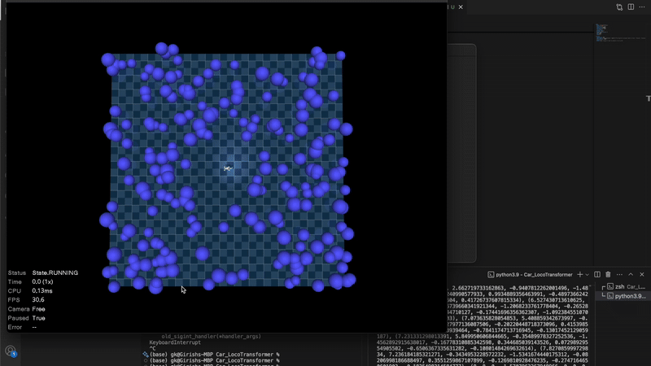

# RRT, MPC and Reinforcement Learning for Mobile Manipulators



---

## Introduction

This repository provides a reinforcement learning (RL) framework for training and evaluating navigation strategies for an Ackermann drive car. It supports both goal-based navigation (where the car learns to move towards a specified goal) and no-goal navigation (where the car learns to survive and move as fast as possible, avoiding obstacles). 

The framework supports three RL algorithms:

* PPO (Proximal Policy Optimization)
* Recurrent PPO (for LSTM-based policies)
* SAC (Soft Actor-Critic)

The system is flexible and configurable via YAML files. 

## Directory Structure

* `cars/`: Contains XML and STL files describing the car model.
* `config/`: Configuration files in YAML format for different training setups.
* `car.py`: Defines the car observables and interactions using the DM Control library.
* `env.py`: Describes the Gym environment for RL training.
* `task.py`: Defines the composer task and reward functions.
* `main.py`: The main entry point for training and evaluation.

## Installation

I used Python 3.9.2 to run this code. The code also requires dm_control, stable-baselines3, and sb3_contrib. You can install the dependencies using the following command:

```bash
pip install -r requirements.txt
```

If running on Apple devices, you can optionally configure for MPS (Apple's Metal Performance Shaders) for accelerated training. If using an Nvidia GPU, ensure CUDA is installed and properly set up.

## Running the Code

### Command-Line Arguments

|Argument|Type|Description|Default|
|---|---|---|---|
|`--model_type`|str|Choose the RL algorithm: `PPO`, `SAC`, `RecurrentPPO`.|`SAC`|
|`--scenario`|str|Specify the navigation scenario: `goal` or `no-goal`.|`no-goal`|
|`--goal_position`|str|Comma-separated goal coordinates for goal-based navigation (e.g. `"5,2"`).|`None`|
|`--config_path`|str|Path to the configuration YAML file.|`config/config_sac.yaml`|
|`--model_path`|str|Path to a saved model (.zip) for continuing training or evaluation.|`None`|
|`--log_dir`|str|Directory to save logs and models.|`./my_experiment`|
|`--file_name`|str|Base name for saved model and logs.|`model`|
|`--eval`|boolean|Set to `True` to evaluate a trained model by loading a model from `--model_path`|`False`|

### Configurations via YAML Files

The hyperparameters and training settings are stored in YAML files in the `config` directory. Examples include `config_sac.yaml` for SAC, `config_ppo.yaml` for PPO, and `config_recurrent_ppo.yaml` for Recurrent PPO. The structure of a config file is as follows:

```yaml
model:
  policy: "MultiInputPolicy"
  batch_size: 64
  learning_rate: 0.0003
  buffer_size: 1000000
  learning_starts: 1000
  train_freq: 1
  gradient_steps: 1
  ent_coef: "auto"
  target_update_interval: 1
  gamma: 0.99
  tau: 0.005
  verbose: 1

training:
  num_obstacles: 200
  model_inputs: ["velocity", "depth"] # This should be a non-empty subset of ["pose", "velocity", "steering", "depth"]
  total_timesteps: 10000
  num_envs: 4
  device: "mps" # Change to "cuda" for Nvidia or "cpu" for CPU
```

The configuration files allow you to modify hyperparameters easily. Make sure to specify the correct inputs in the `model_inputs` field based on what inputs you want to use for the policy. For example, if you want to train a policy that uses only the depth image as input, set `model_inputs: ["depth"]`.

### Training

To start training a new model, use the following command:

```bash
python main.py --model_type SAC --config_path config/config_sac.yaml --scenario goal --goal_position 5,2
```

This command starts training a SAC model for goal-based navigation. It uses the settings from `config/config_sac.yaml`, where you can specify other hyperparameters.

To use PPO:

```bash
python main.py --model_type PPO --config_path config/config_ppo.yaml --scenario no-goal
```

To continue training from a previously saved model:

```bash
python main.py --model_type SAC --config_path config/config_sac.yaml --model_path ./my_experiment/models/model.zip --scenario no-goal
```

### Evaluation

To evaluate a trained model, use the `--eval` flag and specify the `--model_path`:

```bash
python main.py --model_type SAC --config_path config/config_sac.yaml --eval --model_path ./my_experiment/models/model.zip --scenario goal --goal_position 5,2
```

During evaluation, the car will try to navigate based on the previously trained model. Use this mode to observe the car's behavior in a simulated environment.

## Code Structure

### `main.py`

This script is the main entry point for training and evaluation. It parses command-line arguments, loads the configuration file, and initializes the RL agent. It also handles the training and evaluation loops.

### `env.py`

This file defines the Gym environment for the car. It includes the observation space, action space, and the step function that executes the action and returns the next state, reward, and done flag.

### `task.py`

Handles task setup, obstacle generation, and reward functions for different navigation scenarios (goal vs. no-goal).

### `car.py`

Defines the car model and its interactions with the environment. It uses the DM Control library to simulate the car's dynamics and sensor readings.

### `rrt.py`

Implementation of the Rapidly-exploring Random Tree (RRT) algorithm for path planning, used for the baseline.

### `scaled_fk.py`

Forward kinematics model for the UR5e arm on top of the car.

### Running RRT/MPC/RL

To run the RRT baseline, uncomment the part in `main.py` that calls the RRT planner. You can also run the MPC baseline by uncommenting the MPC code in `main.py`. The MPC code is currently commented out to avoid conflicts with the RL training loop.