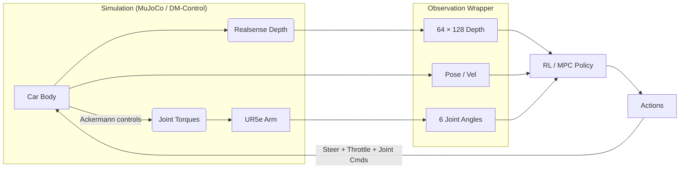

# Autonomous Navigation & Manipulation for a Mobile Base with a 6‑DOF Arm

> **ECE 276C Project — Mobile Manipulator**   \[[Project Report](./report/ECE276C_MobileManipulation_Report.pdf)]  \[[Presentation Video](https://drive.google.com/file/d/18mf8zq6sV6EkAMW_M3rG1ZNKEISJnm9m/view?usp=sharing)]

<div align="center">
  
</div>

---

## Table of Contents

- [Autonomous Navigation \& Manipulation for a Mobile Base with a 6‑DOF Arm](#autonomous-navigation-manipulation-for-a-mobile-base-with-a-6dof-arm)
  - [Table of Contents](#tableofcontents)
  - [About](#about)
  - [Key Contributions](#keycontributions)
  - [System Architecture](#systemarchitecture)
  - [Installation](#installation)
  - [Quick Start](#quickstart)
    - [1️⃣ Train a Vision‑based RL Policy](#1️⃣train-a-visionbased-rlpolicy)
    - [2️⃣ Evaluate a Checkpoint](#2️⃣evaluate-a-checkpoint)
    - [3️⃣ Run the MPC Controller](#3️⃣run-the-mpccontroller)
    - [4️⃣ Generate an RRT\* Path Only](#4️⃣generate-an-rrt-path-only)
  - [Configuration Files](#configurationfiles)
  - [Algorithms \& Workflows](#algorithms-workflows)
    - [Baseline — `rrt.py` + PID](#baselinerrtpypid)
    - [Model Predictive Control](#model-predictive-control)
    - [Vision‑based Deep RL](#visionbased-deeprl)
  - [Directory Layout](#directorylayout)
  - [License](#license)

---

## About

This repository investigates **autonomous navigation and manipulation** for a **car‑like mobile base equipped with a scaled UR5e 6‑DOF robotic arm**.  The robot must escape a **20 × 20 m obstacle field** in MuJoCo while reaching a desired base pose *and* a feasible arm configuration, subject to:

* **Ackermann‑steered kinematics** (non‑holonomic base)
* **Full 6‑DOF arm dynamics** with joint limits & self‑collision checks
* **Static & dynamic spherical obstacles** and an optional goal site

We benchmark three increasingly capable control stacks:

|  Stack              | Global Planner | Local Controller | Highlights                                                                                                     |
| ------------------- | -------------- | ---------------- | -------------------------------------------------------------------------------------------------------------- |
| **Baseline**        | RRT\*           | PID              | Fast but jerky, no constraint awareness                                                                        |
| **MPC Stack**       | RRT\*           | MPC (CasADi)     | Plans smooth, constraint‑aware trajectories with obstacle avoidance formulated inside the optimisation problem |
| **Vision RL Stack** | *end‑to‑end*   | ViT + PPO (SB3)  | Uses depth maps + proprioception to learn policies that generalize to unseen fields                            |

---

## Key Contributions

* **Unified MuJoCo simulation** of Ackermann steering + UR5e, including depth camera and joint observables.
* **Collision Library** (`collision_checker.py`) bridging car pose to arm link frames for real‑time ground/car/obstacle checks.
* **CasADi‑based MPC** with analytic SE(3) kinematics, joint limits, and pre‑computed obstacle constraints for 10 Hz receding‑horizon control.
* **Plug‑and‑play training script** that supports PPO, Recurrent PPO or SAC with vector/depth/point‑cloud inputs.

---

## System Architecture



* **DM‑Control Composer** is used to wire sensors/actuators.
* Observations are marshalled into **Gymnasium**–compatible spaces by `env.py`.
* **Feature extractors** feed either ViT (depth) or PointNet / MLP (vectors) into the SB3 actor‑critic.

---

## Installation

> Tested on **Python 3.9** with **MuJoCo >= 3.1.6** and **PyTorch 2.1**.

```bash
# 1. Clone the repo
$ git clone https://github.com/Girish-Krishnan/MPC-and-RL-Mobile-Manipulator.git && cd  MPC-and-RL-Mobile-Manipulator

# 2. Install MuJoCo & build wheels (follow official instructions)
#    https://mujoco.readthedocs.io/en/latest/

# 3. Install Python dependencies
$ python -m venv .venv && source .venv/bin/activate
$ pip install -r requirements.txt

# 4. (Optional) Enable GPU
$ pip install torch torchvision --index-url https://download.pytorch.org/whl/cu118
```

---

## Quick Start

### 1️⃣ Train a Vision‑based RL Policy

```bash
python main.py \
  --model_type SAC \
  --config_path config/config_sac.yaml \
  --scenario no-goal \
  --log_dir runs/sac_depth
```

TensorBoard logs appear under `runs/sac_depth/tensorboard`.  Checkpoints are saved every `save_freq` steps.

### 2️⃣ Evaluate a Checkpoint

```bash
python main.py \
  --eval \
  --model_type SAC \
  --model_path runs/sac_depth/models/best.zip \
  --scenario goal \
  --goal_position 6,6
```

A DM‑Control viewer will launch; use `Q/E` to tilt camera, `WASD` to navigate.

### 3️⃣ Run the MPC Controller

```bash
python main.py \
  --eval \
  --scenario goal --goal_position 6,6 \
  --model_type SAC  # ignored, we bypass RL
# inside viewer press <SPACE> if simulation is paused
```

MPC parameters (horizon, weights) live in `main.py → mpc_controller()`.

### 4️⃣ Generate an RRT\* Path Only

```python
from task import CarTask
from rrt import RRTStar

task = CarTask(num_obstacles=20)
start = (0,0,0, *([0]*6))
goal  = (6,6,0, *([-1.57,0,0,0,0,0]))
path  = RRTStar(start, goal, task.get_obstacles(), bounds=[(-10,10)]*9).plan()
```

---

## Configuration Files

All experiment knobs are exposed through YAML:

```yaml
training:
  total_timesteps: 2_000_000
  num_envs: 8               # parallel DM‑Control envs
  num_obstacles: 25         # random spheres per episode
  model_inputs: [pose, velocity, depth, joint_positions]
  device: cuda              # or mps / cpu
model:
  policy: "MultiInputPolicy"
  gamma: 0.99
  batch_size: 256
  learning_rate: 3.0e-4
  net_arch: [256,256]
```

Create variants under `config/` and point `--config_path` to the file.

---

## Algorithms & Workflows

### Baseline — `rrt.py` + PID

* Builds an RRT\* tree in **9‑D** space (x, y, θ, 6 joints).
* Collision queries are delegated to `CollisionChecker` combining FK and car bounds.
* A simple PID tracks waypoints.

### Model Predictive Control

* Symbolic dynamics are derived in **CasADi** (`car_arm_dynamics`).
* Constraints include

  * Ackermann kinematics
  * Joint torque & angle limits
  * Sphere avoidance and ground clearance per link
* Warm‑started optimisation reaches 5–10 Hz on CPU.

### Vision‑based Deep RL

* **Observation** = `{vec, depth}` where

  * `vec`: pose, velocity, steering, 6‑joint angles
  * `depth`: 64×128 px float32 range‑scaled depth map
* **Backbone** = `SimpleViT` (2 blocks, 4 heads) + MLP integration.
* **Policy** = Actor‑Critic (SAC/PPO) with 256‑unit hidden layers.

---

## Directory Layout

```text
./
├── feature_extractors/   # ViT & PointNet encoders
├── cars/                 # XML & STL assets for MuJoCo
├── env.py                # Gym wrapper  (observation → dict)
├── task.py               # Composer Task & reward shaping
├── collision_checker.py  # FK‑based collision detection
├── rrt.py                # RRT\* & RRT planners
├── scaled_fk.py          # Analytic FK (NumPy & CasADi)
├── main.py               # Training / evaluation entry‑point
├── requirements.txt
└── README.md             # <–– you are here
```

---

## License

This project is licensed under the **MIT License** – see [`LICENSE`](LICENSE) for details.
